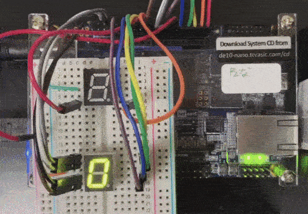
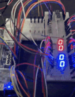

# FPGAprojects

The details can be found [here in my Blog Post](https://dev.to/lambdamamba/using-the-gpio-for-external-inputs-and-outputs-for-fancy-fpga-projects-2697)

## FSM
The demo for [FSM1.v](./FSM/FSM1.v)

 

## Morse Code
The demo for [morse.v](./MORSE/morse.v)

 

## Pipeline MIPs CPU
The demo for [mips_cpu.sv](./PIPELINE_CPU/mips_cpu.sv)

 

The more detailed demo is shown in my [Youtube Video](https://youtu.be/NWythYaezBQ).
